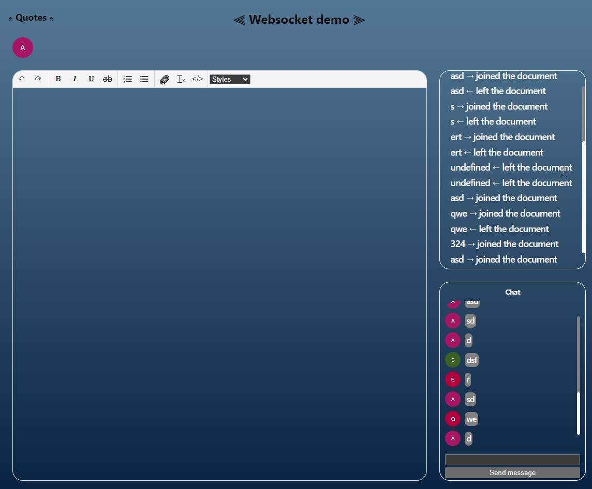

# <a id="top" />React - Node.js - Websocket

---

### Оглавление

- [Описание](#description)
- [Ссылки](#references)

---

## <a id="description" />Описание и особенности
  Вебсокет демо. Онлайн-редактор текста, чат. Серверная часть - Node.js, Express, TypeScript. Клиент - React.js + TypeScript
  Базовый функционал был взят из этого [→ туториала ←](https://blog.logrocket.com/websocket-tutorial-real-time-node-react/). Произведен рефакторинг, доработка и расширение функционала.

  Подробнее в readme файлах отдельной части проекта.
### Технологии

- React js
- Typescript
- react-use-websocket (websocket client hook)
- Zustand (state manager)
- Node.js
- ws (websocket server)
- Express.js

[Наверх](#top)

---

## <a id="references" />Ссылки

### [- Клиент readme](./client/README.md)

### [- Сервер readme](./server/README.md)

[Наверх](#top)
